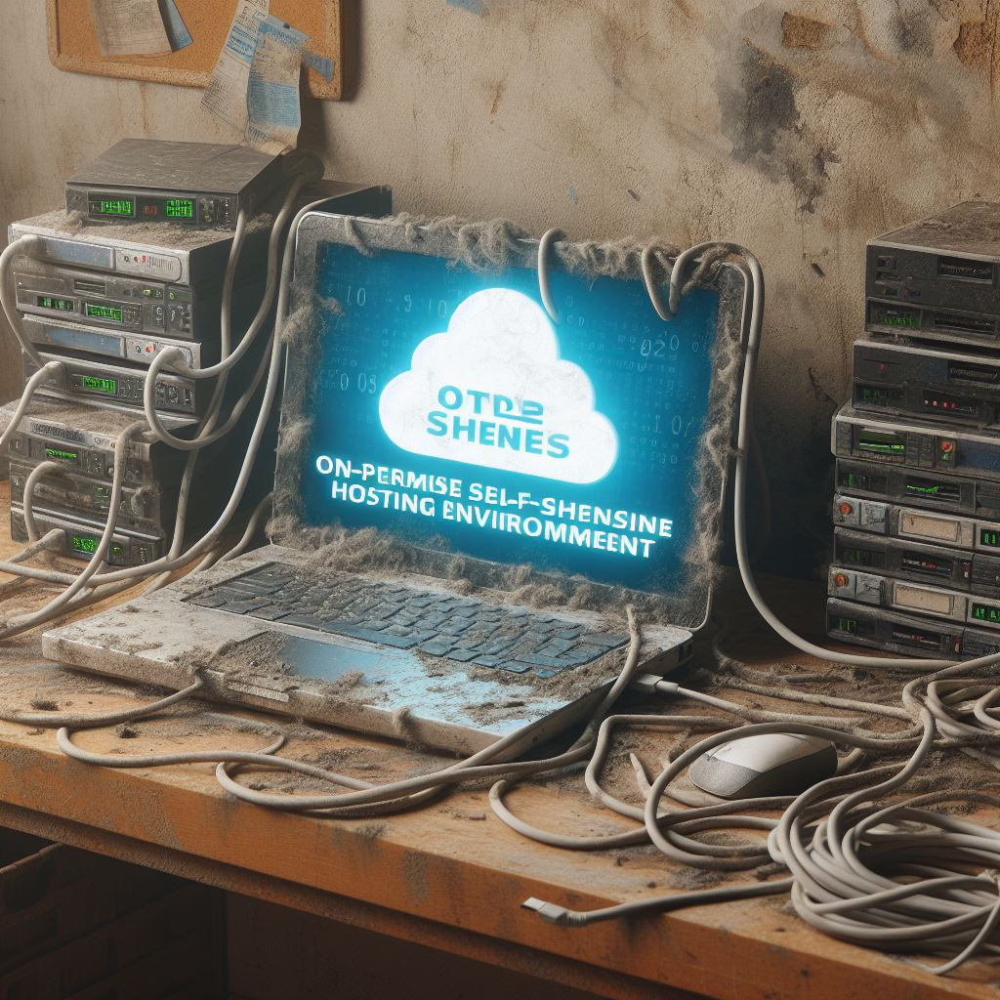

# Introduction to Full Stack Web Development

next

## This course uses [reveal.js](https://revealjs.com/) for its presentation

Some slides (such as this) have sub-slides.

Use the **Down**-Arrow to view them.

Use the **Right**-Arrow to navigate to the next full slide.

(Or just press **Space bar** to navigate (sub)-slide for slide)

Try it now!

sub

Hi! I am the **sub**-slide :)

next

Hi! I am the **next** slide (I hope you did not miss the sub-slide on the previous page) ;)

next

# What does a Full-Stack Web Developer do?

sub

- Working on backend _and_ frontend and all its facets
- Having a broad skill set, ranging from **planning architectures** over **development** to **deployment / hosting**. 
  - "**Jack of all trades**":  an individual who knows enough from many learned trades and skills to be able to bring the disciplines together in a practical manner. This person is a generalist rather than a specialist. (thanks Wikipedia :D)

next

# Backend

The **backend** is not only a single web server application but:

next

## Web Applications:
## Web Frameworks 

 Request Handling + Serving (dynamic) content

sub 

- Aids development of web applications, easy **serving** of (static and) dynamic content.
- **Modular**: Easy to add templating engines, database interaction, session handling, etc.

sub 

### Example **technologies**:
- Node.js (runtime) + Express.js (web framework) (Javascript / Typescript)
  - This course uses Node.js for the practical part
- Spring (Java / Kotlin)
- Django, Flask (Python)
- Ruby on Rails (Ruby), ...

next

## Web Applications: 
## Server-side web APIs

Exchanging data with the web application

sub
- API: _Application Programming Interface_
- One or more publicly exposed **endpoints** that form a **request-response message system**.
- Messages are typically exchanged in **JSON** or **XML**.

sub

- HTTP request methods (GET, HEAD, POST, PUT, DELETE, ...) can be used to differentiate meaning:
  - GET `https://my.server/api/user/117`
    - Request information about user 117
  - DELETE `https://my.server/api/user/117`
    - Delete user 117

sub

### Example technologies:
- REST (Representational state transfer): Client-server architecture, Statelessness, Cacheability, Layered system, Code on demand (optional), Uniform interface (HATEOAS)
  - Richardson Maturity Model
  - **Nearly no HTTP-based API is really RESTful, only REST-based** (HATEOAS)
- OpenAPI + Swagger: Defining APIs
- Postman: Testing APIs
- ...

next

## Database
Persistent storage of data

sub

### (I) Relational databases
- Tables, Rows (Records), Columns (Attributes), Primary and Foreign Keys
- Example technologies: Oracle DB, MySQL, Microsoft SQL Server, PostgreSQL, ...

sub

#### ORM

ORM = _Object-relation mapping_

Plain SQL:

```js
// Untyped
const allUsers = (await database.query('SELECT * FROM "User"')).rows;
```

Using ORM (In this example: [Prisma](https://www.prisma.io/)):

```
model User {
  id       Int      @id @default(autoincrement())
  username String
  email    String
}
```

```js
// Advantage: Typescript types
const allUsers = await prisma.user.findMany();
```

sub

### (II) NoSQL databases

NoSQL systems are sometimes called "Not only SQL".

sub

#### (II.a) Key-Value Stores / Document stores
- Key-Value store: use an associative array (map / dictionary) as their fundamental data model.
- Document store: Stores **documents** (with unique **keys**) in **collections**.
  - Compared to relational databases: 
    - Collections ~ Tables | Documents ~ Records
    - But records in a table have the same fields, while documents in the same collection may have fields that are completely different.

sub

- Uses own query language, for example MongoDB: 
  ```[0|3,7]
  // SQL
  SELECT * FROM inventory 
  WHERE status = "A" OR qty < 30

  // MongoDB
  db.collection('inventory').find({ 
    $or: [{ status: 'A' }, { qty: { $lt: 30 } }] 
  });
  ```

sub

##### Example Technologies

Amazon DynamoDB, CouchDB, Cochbase, MongoDB, Elasticsearch, ...

sub

#### (II.b) Graph databases
- Uses nodes (that store properties) and (labelled, directed) edges to represent and store data
- Uses own query language, for example _Cypher_:
  ```
  MATCH (p1:person {name: 'Jack'})-[:FRIEND_WITH]-(p2:person)
  RETURN p2.name
  ```
- Examples: Neo4j, Microsoft Azure Cosmos DB, ...

sub

### (III) Things to consider

- Backup strategies
- Migrations
- Scalability
- ...

next

## Webserver

Did someone say indirection?

sub

- **Static content** is often handled by a web server
- Major application: **Reverse Proxy**
  - Forward client requests for dynamic content to web applications.
  - Useful for **multiple web applications** on the same IP / URL. Can also be used for **A/B testing**.
- Other useful tasks: **Load Balancing**, **Caching**, **TLS (HTTPS) encryption**, **DDOs defense**, **Authentication**
- Example **technologies**: Apache, nginx, Caddy, ...

next

## Hosting

Move _everything_ to the cloud?

sub

### Self-hosted



_(Yeah, AI cannot generate good text on images :P)_

sub

- Hosting your application on **servers that you own**, manage, and maintain. 
  - This could be on-premises servers or servers in a data center that you have control over.
- **Advantages**: Full control over hardware and software, potential cost savings for large-scale operations.
- **Considerations**: Requires significant technical expertise, maintenance responsibility, and potential upfront infrastructure costs.

sub

### v-server / Rented Server (Virtual Private Server - VPS)


sub

- Utilizing a virtualized server environment where you **rent a portion of a physical server** with dedicated resources.
- **Advantages**: Cost-effective for moderate traffic websites.
- **Considerations**: Limited scalability compared to cloud solutions, some responsibility for server maintenance.

sub

### Cloud


sub

- Hosting services provided through cloud platforms, offering scalable resources and a variety of services on a pay-as-you-go model.
- **Advantages**: Scalability, flexibility, a wide range of services, and often cost-effective for variable workloads.
- **Considerations**: Dependency on the cloud provider, potential cost concerns for consistently high resource usage.

next

# Frontend

The **frontend** is not only HTML but:

next 

## Libraries 

Do not re-invent the wheel

sub

jquery, lodash, axios, d3, ...

next

## Frameworks 

  <!-- .element: class="fragment" -->

sub

### (I) React

sub

### (II) Vue.js

sub

### (III) Angular

sub

### (IV) ... and more

next

## Asynchronous communication

Gone are the days of full page reloads

sub

- Grandparent: Ajax (Asynchronous JavaScript and XML - first appeard 1999) and `XMLHttpRequest` (first appeared 2000 in Microsoft Outlook, first W3C working draft specification 2006)
  - Despite its name, XMLHttpRequest can be used to retrieve any type of data, not just XML.
- axios, fetch, ...

next

## Styling 


sub

[CSS](https://developer.mozilla.org/en-US/docs/Web/CSSS), [SASS](https://sass-lang.com/), [LESS](https://lesscss.org/), ...

sub

[Selector Syntax](https://en.wikipedia.org/wiki/CSS#Summary_of_selector_syntax)

sub

### Styling with libraries 

[Bootstrap](https://getbootstrap.com/), [Tailwind](https://tailwindcss.com/), [Foundation](https://get.foundation/), ...

sub

In general use a combination of [CSS Flexbox](https://developer.mozilla.org/en-US/docs/Learn/CSS/CSS_layout/Flexbox) and [CSS Grid](https://developer.mozilla.org/en-US/docs/Learn/CSS/CSS_layout/Grids).

next

# Languages

- Javascript
  - or Typescript
- Java
  - or Kotlin
- Python
- Ruby
- PHP
- SQL / DB query languages
- ...

next

# Cross-cutting concerns (Not the right heading yet)

sub

- dependency management (npm, yarn, ...)
  - i.e., combining other people's work into one nice thing

sub

- transpilations (Typescript -> Javascript)
  - i.e., transforming one language into another

sub

- compilation (Javascript -> Web Assembly)
  - i.e., transforming on language into a low-level language / machine code

sub

- just-in-time compilation (Web Assembly)
  - i.e., a VM optimizing code at run time

sub

- bundling / build tools / task runners (webpack, browserify, vite, gulp, ... )
  - i.e., managing the above tasks
  - bundling = combining multiple files into a single **small** one / a few **small** ones

next

# And the good thing:
### You learn most of this stuff along the way :)

But you need to have a basic understanding to able to understand what you are still lacking and what to be looking for.

next

# This is the goal of this course

To give you enough knowledge to get started developing full-stack
knowing that there are topics you could dive into deeper.

next

<!-- .slide: data-background-image="https://media.giphy.com/media/Mgt4Ttvxfp7CmedT5m/giphy.gifffffffffffff"-->

